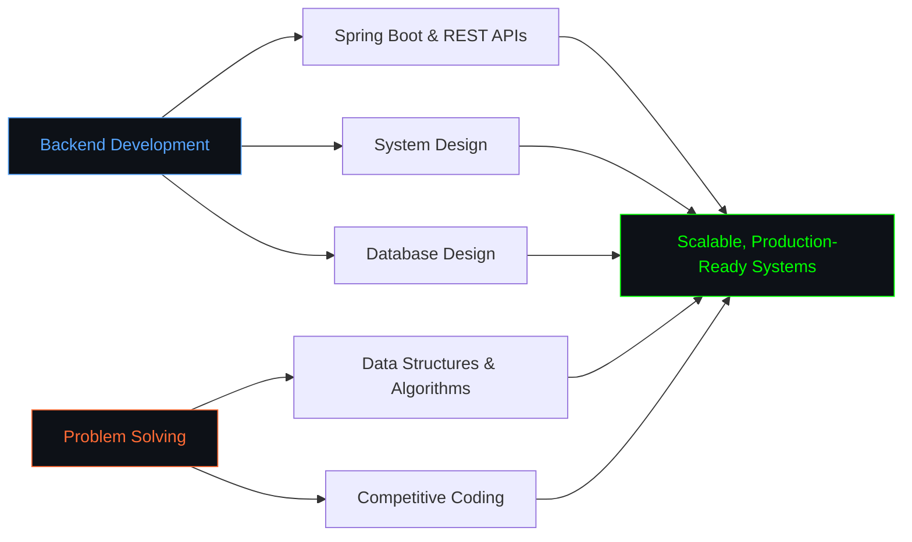

<h1 align="center">Hi 👋, I'm Aditya Agarwal</h1>
<h3 align="center">Full Stack Java Developer | Spring Boot | React & Redux | Building scalable backend systems</h3>

<p align="center">
  
</p>

<p align="center">
  <a href="https://www.linkedin.com/in/aaditya-agrawal-1020803b1"></a>
  <a href="https://x.com/aadi_74"></a>
  <a href="https://www.instagram.com/txr_aadi"></a>
  <a href="https://www.youtube.com/@heyaditya022"></a>
</p>

---

### 💫 About Me

```java
public class Aditya {
    String name = "Aditya Agarwal";
    String role = "Full Stack Java Developer";
    String location = "Delhi, India";
    String[] currentlyLearning = {"Advanced DSA", "System Design", "Spring Boot Internals"};

    String[] collabInterests() {
        return new String[] {
            "Open-source Java projects",
            "Backend development",
            "DSA & system design communities"
        };
    }

    String[] askMeAbout() {
        return new String[] {"Java", "Backend Development", "Problem Solving", "Spring Boot"};
    }
}
```

- 🔭 Currently building backend systems with **Spring Boot** & **REST APIs**
- 🌱 Currently learning **Full Stack Java Development**, **MySQL**, and **Data Structures & Algorithms**
- 🤝 Looking to collaborate on **open-source Java / backend projects**
- 🆘 Looking for help with **advanced DSA**, **system design**, and **scalable backend architecture**
- 💬 Ask me about **Java, backend development & problem solving**
- 📍 Based in **Delhi, India**

---

### 🛠️ Tech Stack

**Languages**
<p>
  
  
  
  
  
</p>

**Backend & Frameworks**
<p>
  
  
  
  
</p>

**Frontend**
<p>
  
  
  
  
  
</p>

**Cloud & DevOps**
<p>
  
  
  
  
</p>

**Databases**
<p>
  
  
</p>

---

### 🎯 Focus Areas



---

### 📊 GitHub Stats

<p align="center">
  
</p>

<p align="center">
  
</p>

<p align="center">
  
</p>

<p align="center">
  
</p>

---

### 📌 Pinned / Notable Repositories

- **[Aaditya022](https://github.com/Aaditya022/Aaditya022)** — Personal profile README repo
- **[memory-engine](https://github.com/Aaditya022/memory-engine)** — The Organizational Brain for Enterprise AI, powered by Cognee, Gemini & Knowledge Graphs
- **[wells-fargo-task-2](https://github.com/Aaditya022/wells-fargo-task-2)** — Wells Fargo Software Development Forage program (Task 2)

---

<p align="center">
  
</p>

<p align="center"><i>"Learning to build systems that scale, one line of code at a time."</i></p>
