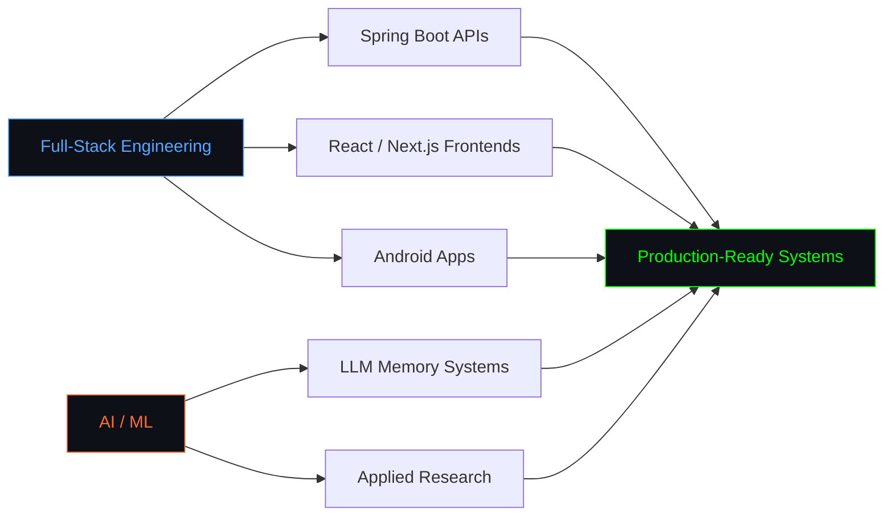
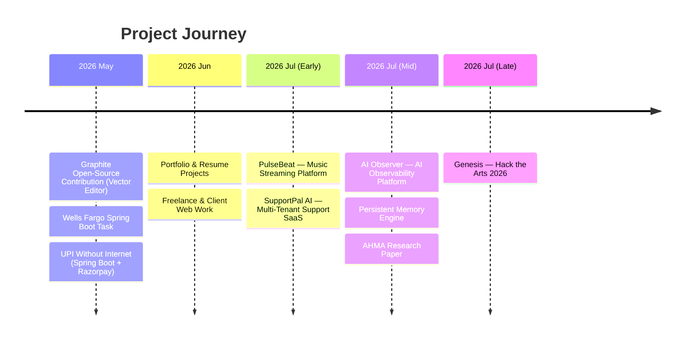

# Aditya Agarwal // Tell Your Boss Schrodinger I Survived


[](https://git.io/typing-svg)


```python
class Aditya:
    def __init__(self):
        self.role = ["Full-Stack Developer", "AI/ML Enthusiast"]
        self.education = "BCA — Graphic Era University | MCA (AI/ML) — IIIT Ranchi"
        self.location = "Delhi, India"

    def tech(self):
        return {
            "languages": ["Java", "JavaScript", "TypeScript"],
            "backend": ["Spring Boot", "Node.js", "Express.js"],
            "frontend": ["React", "Next.js"],
            "mobile": ["Android"],
            "infra": ["Docker", "PostgreSQL", "Redis", "Kafka"],
        }

me = Aditya()
```

Full-stack developer and AI/ML-focused MCA student, building production-grade
systems end to end — from Spring Boot backends and React/Next.js frontends to
Android apps and AI-powered platforms.


## Tech Stack


## Focus Areas




## Project Timeline




## What I'm Building

- **AI Observer** — AI-powered observability platform (Spring Boot + Next.js + Ollama), integrating with SigNoz for autonomous anomaly detection and root-cause analysis.
- **PulseBeat** — Large-scale Spotify-like music streaming platform: Spring Boot multi-module backend with JWT/OAuth2, Kafka event flow, HTTP range streaming, paired with a React + TypeScript + Tailwind frontend.
- **SupportPal AI** — Multi-tenant AI customer support SaaS with role-based access (Customer/Agent/Admin), built on Spring Boot 3.3, Next.js 15, and graph/vector memory (Cognee).
- **Persistent Memory Engine** — Production-grade Spring Boot service giving AI meeting assistants cross-meeting memory, using PostgreSQL + pgvector and hybrid BM25/vector search.
- **AHMA Paper** — Research on Adaptive Hybrid Memory Architecture for long-term conversational LLMs.
- **Genesis** — Persistent shared procedural planet/artwork built for Hack the Arts 2026.


## Open to Collaboration

| 🖥️ **Software Development** | 🧠 **AI Development** | 📊 **Data Science** | 🌐 **Open Source** |
|---|---|---|---|
| Full-Stack Applications | Computer Vision & NLP | Predictive Modeling | Community Projects |
| API & Microservices | LLM / RAG Applications | Analytics & Visualization | Code Review & Mentoring |
| System Architecture | ML Pipeline Engineering | Competitive DS | Developer Tooling |


## GitHub Stats


---

*"Building the bridge between software craftsmanship and artificial intelligence — one system at a time."*

[](https://www.linkedin.com/in/aaditya-agrawal-1020803b1/)
[](mailto:heyaditya022@gmail.com)
[](https://instagram.com/txr_aadi)
[](https://leetcode.com/aaditya022)


> Spotify widget needs (re-)authorization to show your recently played tracks — sign in once at https://spotify-recently-played-readme.vercel.app to link your account, then swap `REPLACE_WITH_SPOTIFY_USER_ID` above with your generated user ID.


